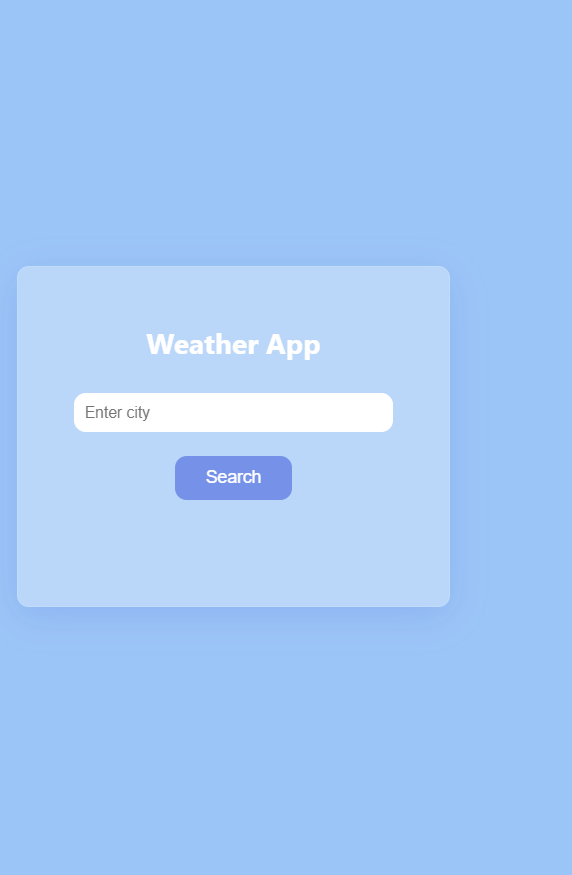
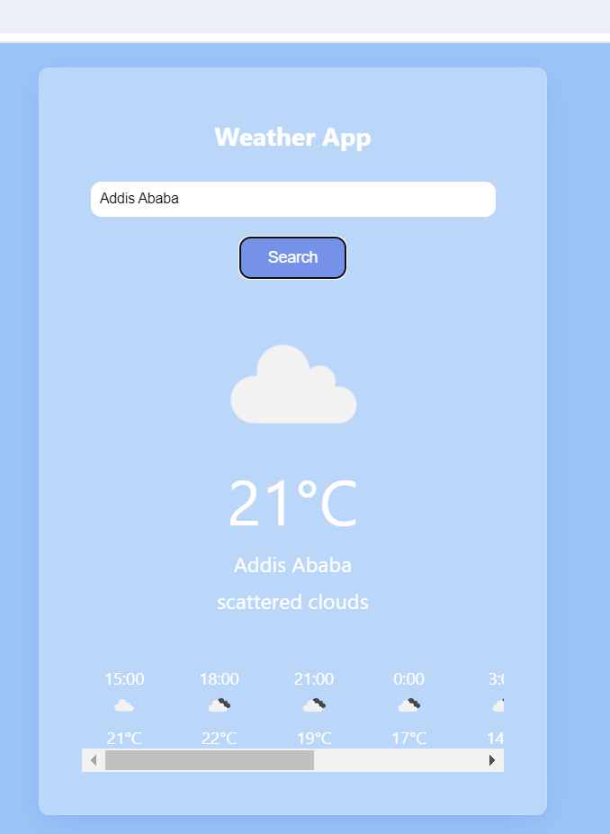

# Weather App

A simple and intuitive weather application that fetches real-time weather data using an API. 
This app provides current weather conditions, forecasts, and other relevant meteorological information for any location.

## Features

- Real-time weather updates
- 8-day weather forecast
- Detailed weather information (temperature, humidity, wind speed, etc.)
- Search functionality by city or coordinates
- Responsive design for mobile and desktop

## Screenshots




## Getting Started

Follow these instructions to get a copy of the project up and running on your local machine.

### Prerequisites

- A web browser
- A code editor (optional, for modifications)

### Installation

1. Clone the repository:
   ```bash
   git clone https://github.com/eliasdm/weather-app.git
2. Navigate to the project directory:
                    cd weather-app
3.   Obtain an API key from OpenWeatherMap or any other weather API provider.
4.   Open the index.html file in your preferred code editor and locate the following line:
                    const apiKey = 'your_api_key_here';
5. Open the index.html file in your web browser to see the app in action.

   
   ## Usage
1. Enter the name of a city in the search bar to get current weather information.
2. The app will display the current weather conditions and a 8-day forecast.
3. scroll horizontally to get detailed weather information for that day.

  ## Built With
HTML - For the structure of the app
CSS - For styling the app
JavaScript - For the app functionality
OpenWeatherMap API - The weather data provider


##contact me


[Email: elias.dm257@gmail.com](elias.dm257@gmail.com)
   
